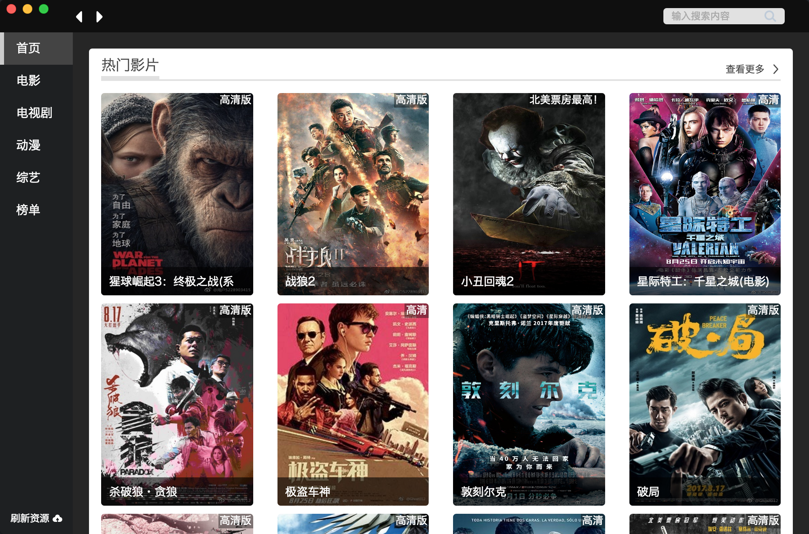

## Easy-Video
> 基于VUE和Electron的视频播放器（资源来自网络采集！仅供学技术习）



#### 运行步骤：
```sh
# Clone this repository
git clone https://github.com/DrawAChicken/Easy-Video

# Go into the repository
cd Easy-Video

# Install dependencies
npm install  # 推荐yarn！！ npm install会生产多余文件，使体积增大

# Run the app
First =>  npm run dev  #运行web页面
Then  =>  npm start    #运行electron

# build ELectron
First =>  npm run build             #打包成app
Then  =>  npm run appdmg            #打包成Mac安装包
```
### 开始吧！
- resource文件就是Vue
- 关于node和electron的API 封装在config/api里
- 在resource里引用，一看便知
- 在vue打包完后，会在目录下生产dist文件，文件包含所有静态资源

求star 求Issues